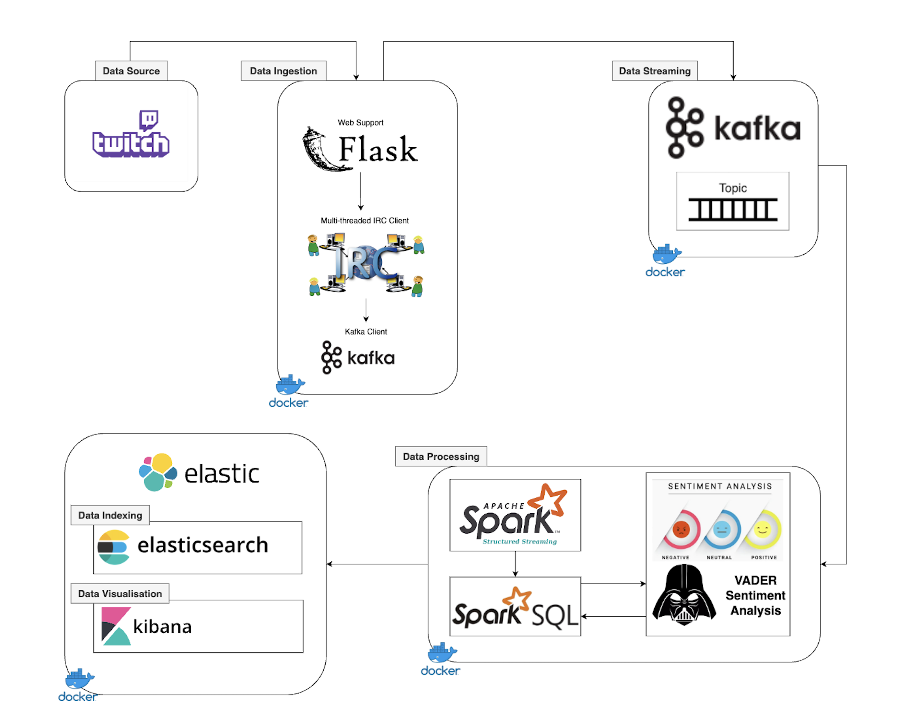

# Real Time Twitch Chat Analyzer

## Goal Description
The main goal of the project is to provide a useful tool for monitoring and analyzing live chat events on Twitch using sentiment analysis. 
The tool should enable moderators and streamers to easily keep track of the interactions between the streamer and its audience and provide valuable insights into the sentiments and emotions of the audience.
## Tech Stack

**Flask:** Used for web development to build the user interface and handle user input.

**Kafka:** Used for data ingestion to collect real-time chat data from Twitch streamers.

**Spark:** Used for data processing to perform sentiment analysis on the chat data using the VADER sentiment analysis library.

**Elasticsearch:** Used for data indexing to store and manage the processed data.

**Kibana:** Used for data visualization to create beautiful visualizations of the processed data.

**Docker:** Used for containerization.

**VADER:** Used for sentiment analysis.

`VADER (Valence Aware Dictionary and Sentiment Reasoner) is a lexicon and rule-based sentiment analysis tool that is particularly suited for analyzing social media data, such as tweets and online reviews. It is designed to handle sentiment expressions that are commonly used in social media, including slang, emoticons, and idioms, and can handle both positive and negative sentiment expressions. Twitch chat data can be difficult to analyze because it often contains a lot of informal language and emoticons. VADER is well-suited for this type of data because it can handle these types of expressions and provide accurate sentiment analysis results. Additionally, VADER is open-source and easy to use, making it a popular choice for sentiment analysis tasks.`

## Project structure

<p align="center"></p>

The project workflow follows the structure above.

## Demo
[**Demo**](https://youtu.be/mBHeTSKoaug "channel") video is available on my youtube channel.
  
## Detailed Explanations

- [**Flask**](https://github.com/ozgurtaylan/real-time-twitch-chat-analyzer/tree/main/flask "Flask")

- [**Kafka & Zookeeper**](https://github.com/ozgurtaylan/real-time-twitch-chat-analyzer/tree/main/kafka-zookeeper "Kafka & Zookeeper")

- [**Spark**](https://github.com/ozgurtaylan/real-time-twitch-chat-analyzer/tree/main/spark "Spark")

- [**Elasticsearch & Kibana**](https://github.com/ozgurtaylan/real-time-twitch-chat-analyzer/tree/main/elasticsearch-kibana "Elasticsearch & Kibana")

  
## Running

### Docker
This project uses Docker as a containerization tool. Make sure you have it installed.
### env.env

To use this project on your own computer, **you'll need to provide your own Twitch API credentials** in the form of environment variables. These credentials are necessary for the application to connect to the Twitch chat using the IRC protocol.
The **env.env** file in the root directory of the project is a file that is uncompleted and you need to provide your own credentials and it is also required for the Docker. The file contains the names of the required environment variables, but no values. Here are the required environment variables:
* **`MY_SERVER`**: The address of the Twitch chat server. This should be set to “**irc.chat.twitch.tv**”.
* **`MY_PORT`**: The port number for the Twitch chat server. This should be set to “**6667**”.
* **`MY_NICKNAME`**: Your Twitch username.
* **`MY_AUTH`**: The authentication token that you obtained from the Twitch API. This token should be in the form of oauth:<your token>.

Detailed Information = https://dev.twitch.tv/docs/authentication/

To get complete **env.env** file, you can simply edit the file with your favorite editor.(VSCode may be helpful)

### Docker Compose

Since this project is a multi-container application, we can use to start the containers with the help of Docker Compose.

Clone project

```bash
  git clone https://link-to-project
```

Go to directory that you selected 

```bash
  cd real-time-twitch-chat-analyzer
```

Start and run the entire app

- Make sure **env.env** file is completed correctly

```bash
  docker compose --env-file env.env up
```

### Access

Web interface is accessible from **http://localhost:8000**

You may also access:

- Spark web interface = **http://localhost:4040**
- Kibana web interface = **http://localhost:5601**

### Important

**Please note that this project is still in development and may contain bugs or leaks. It has not been developed to with the aim of rigor as professional-grade software.**

When your job is done, make sure to use
```bash
  docker compose down
```
command for preventing resource issues. It also helps to stop and remove containers, networks, images, and volumes.