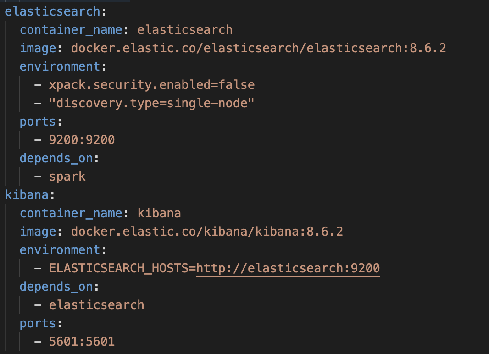

# Elasticsearch & Kibana

Screenshot from compose file about the related part.

**Elasticsearch** is a distributed search and analytics engine that allows us to store, search, and analyze large volumes of data quickly and in real-time. **Kibana** is a web-based UI that enables us to visualize and explore our Elasticsearch data.

In the project, **Elasticsearch and Kibana Docker images** are provided by **Elastic.co** as base images. The Elasticsearch image we use is based on version **8.6.2**, and the Kibana image is also based on the same version.

Using Docker images provided by Elastic.co allows to quickly and easily set up Elasticsearch and Kibana on local development machines. The images are **pre-configured** with the necessary dependencies and settings to run Elasticsearch and Kibana, which saves time and effort.

In the project, Elasticsearch and Kibana are used to index and visualize data in real-time. Elasticsearch is configured to run in a single-node mode, which means that it runs on a single container and does not require a cluster setup. Also, **xpack security** is **disabled** to simplify the setup process.
Kibana is used for creating visualizations and dashboards to analyze our data. Kibana is configured to communicate with Elasticsearch through the **ELASTICSEARCH_HOSTS** environment variable, which points to the Elasticsearch container running on the same Docker network.
