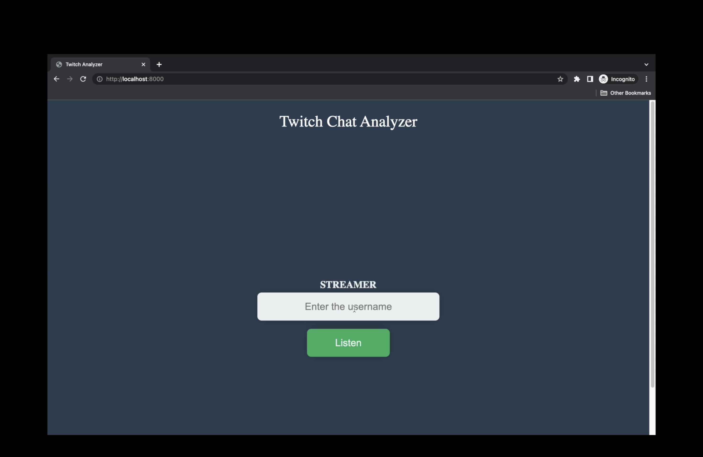

# Flask

## Socket Programming and IRC

Twitch, a live streaming platform for gamers, uses IRC as its chat protocol.

`IRC (Internet Relay Chat) is a text-based chat protocol that was developed in the late 1980s and is still widely used today. It allows users to send and receive text messages in real-time, making it a popular choice for online chat services.`

Python socket programming is used in this code to connect to Twitch's IRC server, send authentication credentials, and retrieve chat messages from a specific channel. The chat messages are then processed and sent to a Kafka topic for further analysis.

## Environment Variables and Connection

Environment variables(which are given in **env.env** file) are used for the socket connection.
The following environment variables are used:
* `MY_SERVER`
* `MY_PORT`
* `MY_NICKNAME`
* `MY_AUTH`
These environment variables are used in the function, which sets up a connection to an IRC chat room and starts listening for messages. By using environment variables, the code can be easily configured to connect to different servers and channels without having to modify the code itself. This makes it more portable and easier to deploy in different environments.

## Multi-Threaded Approach
Multi-threaded approach is used to handle the chat messages retrieved from Twitch's IRC server. This is because Flask does not provide a default background task feature, so a separate thread is created to handle the retrieval and processing of chat messages in the background while the main Flask application continues to serve incoming requests. The use of multiple threads allows for concurrent processing of chat messages and prevents blocking of the main application thread. This approach ensures that the chat messages are retrieved and processed in a timely and efficient manner.

## Data

In the code, after connecting to Twitch's IRC server and retrieving chat messages, the chat messages are preprocessed to obtain the essential data. The preprocessing involves parsing the messages and extracting relevant information such as:

**`order:`** order of incoming messages

**`streamer:`** username of the owner of th chat or streamer

**`time:`** timestamp

**`username:`** username of person who send the chat message

**`message:`** content of a single chat message

Once the essential data has been obtained, it is sent to a Kafka topic for further processing and analysis. This enables the data to be consumed in real-time by other services or applications that are subscribed to the Kafka topic. By utilizing Kafka, the code is able to provide real-time messages to other clients on the same network, allowing for seamless integration with other applications and services.

## Kafka
In the code, the application is acting as a Kafka client and is able to send messages to a Kafka topic. To achieve this, the application uses the **kafka-python** library to create a Kafka producer. The Kafka producer is configured to connect to a Kafka broker using the broker's IP address and port number. The Kafka broker must be running in another container on the same network as the Flask application.

Once the Kafka producer is set up, the application uses it to send messages to a specific Kafka topic. In this case, the messages being sent are chat messages retrieved from a Twitch channel. These chat messages are sent to the Kafka topic in real-time, as they are retrieved from the channel.
To ensure that the Kafka producer does not block the main Flask thread, a separate thread is used to send messages to the Kafka topic. This multi-threaded approach allows the Flask application to continue serving HTTP requests while sending messages to the Kafka topic in the background.

## Screenshots

