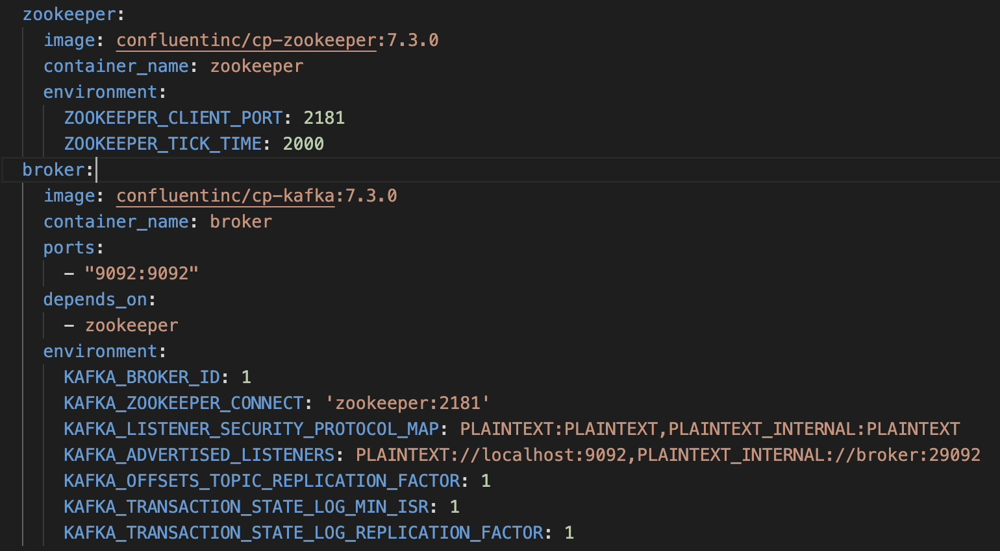

# Kafka

Screenshot from compose file about the related part.

In the project, **Kafka** and **Zookeeper** are used for real-time data streaming and messaging queue on a local standalone deployment. Kafka acts as a messaging system, allowing us to collect data in real-time, while Zookeeper manages the distributed systems and keeps track of the Kafka brokers and their configuration.

To set up Kafka and Zookeeper, **Docker Compose file** is used to run them as Docker containers on a single machine. The Compose file defines two services, **Zookeeper** and **Broker**, with the Broker service dependent on the Zookeeper service. By using Kafka and Zookeeper in the project, we are able to efficiently process and manage real-time data on a local machine.

Also, **Confluent** is the company behind the development of Apache Kafka and provides a complete stream data platform based on Kafka. They offer various products and services that enable organizations to build and operate real-time data streaming applications at scale.
In the provided YAML file above, **Confluent's Kafka and Zookeeper** Docker images is used to run Kafka and Zookeeper as Docker containers. These images are based on the open-source Apache Kafka and Zookeeper projects but come with **additional features** and tools provided by Confluent, such as monitoring and management capabilities.

The **environment variables for the Zookeeper** container specify the **port number** and the **tick time** for Zookeeper. The **environment variables for the Kafka** container specify the **broker ID**, **Zookeeper connection string**, **listener security protocols**, **advertised listeners**, **offsets topic replication factor**, and **transaction state log replication factor**.
These variables are set based on the best practices recommended by Confluent. By using these variables, we can ensure that our Kafka and Zookeeper containers are properly configured and can communicate with each other for real-time data processing and streaming.